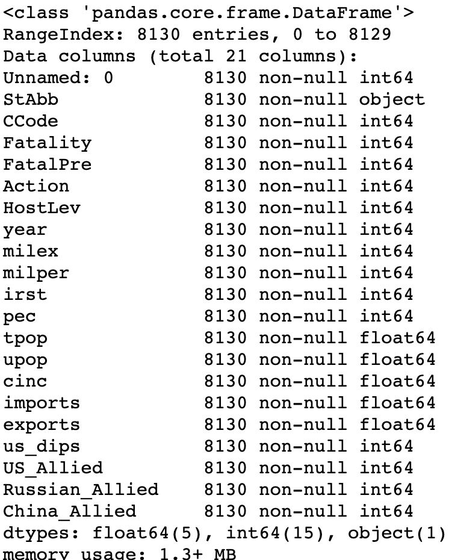
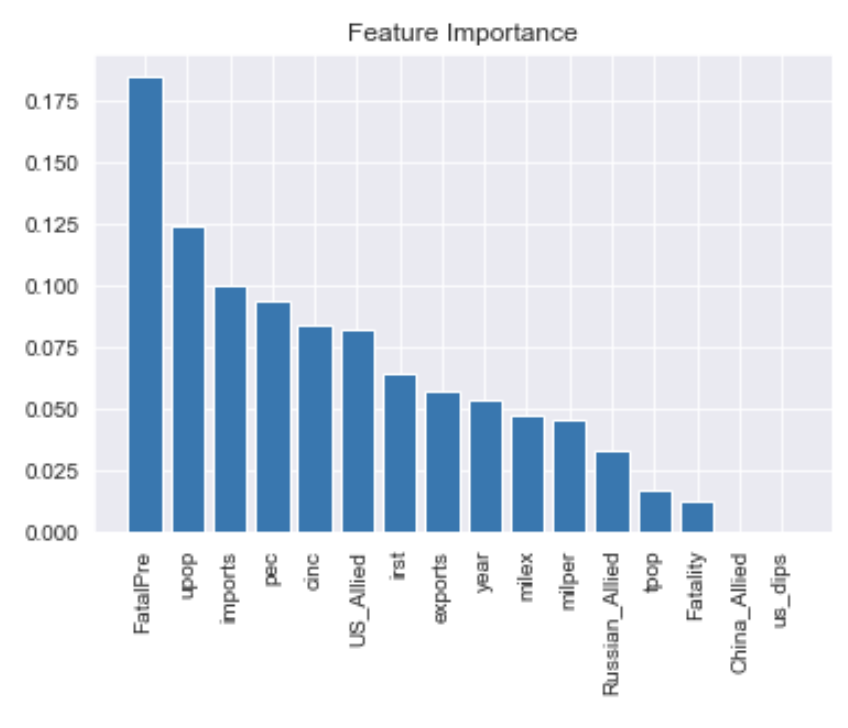

# conflict_peace
I wanted to see if i could predict whether disputes between countries would result in some sort of military action or if the dispute would result in nothing but threats. I used data sets from the Correaltes of War project. They have brought together different datasets ranging from military power, diplomatic & allie relations, etc. I took features from a few different data sets to see if i could predict military action from a dispute. I engineered a few features from the datasets, US Allies, Russian Allies, China Allies. The thinking is that having a relationship with one of the three superpowers might affect how a dispute is going to end up. There were over 8,000 disputes in an 18 year span.Here is a list of the variables used in the project:

It isn't surprising that fatalities on the initial dispute is the biggest factor that could lead to a military action, but it is interesting to see the other higher ranking features. In the feature chart below you will see that urban population, imports and energy consumption are the next highest ranking features. All three variables seem to be very vurnerable to world trade dynamics. 

